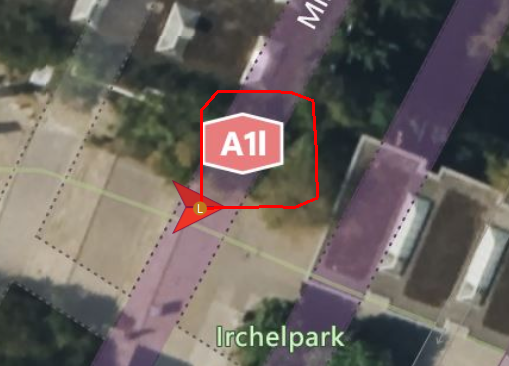

# Drone Gazebo Simulation Environment with ROS2, PX4, and MAVROS

Welcome to the **Drone Simulation Environment** project! This repository provides a comprehensive setup for simulating drones using ROS2, Gazebo Sim, PX4, and MAVROS. The ultimate goal is to establish a robust experimental environment for multi-robot systems. (`Task allocation`)

## Prerequisites Knowledge

Before using this repository, ensure you have the following installed:

- ROS2 ( Humble )
- PX4  (px4_msgs , px4_ros_com )
- MAVROS
- MAVLINK
- QGC

## Install

For those who need a complete setup, Docker images are available at the link below. These images provide a fully configured environment to get you started quickly.

[Download Docker Images](https://hub.docker.com/r/psi0921/multi_px4_ros2_setup/tags) <!-- Add your Docker image link here -->

After Download , change env setting at  **`sim.sh`** to adjust to your environment (container name, mounted space).

Then, execute **`sim.sh`**

```bash
chmod +x sim.sh
./sim.sh
```


## Branch Overview

### `base_sim Branch`

This branch contains the fundamental scripts for basic drone operations.

- **`start.py`**: This script handles the takeoff and transitions the drone to OFFBOARD mode, allowing it to hover in the air.
- **`wp_patrol.py`**: This script patrols a predefined set of waypoints and returns the drone to its takeoff location.

These scripts are designed for single robot operations and use MAVROS for local position control. 
For global position commands, consider using different services and message types. Note that the drone must be in OFFBOARD mode to respond to waypoint commands. 
If you prefer manual takeoff and landing without using AUTO modes, refer to the commented sections in `wp_patrol.py`.


### `multi_sim Branch`

Development for multi-robot simulation is ongoing. Stay tuned for updates!

## Execution

first, in host

RUN, _**QGroundControl.AppImage**_

second, in container

```bash
#default id =1
cd ~/PX4-Autopilot & PX4_SYS_AUTOSTART=4001 PX4_SIM_MODEL=gz_x500 ./build/px4_sitl_default/bin/px4 -i 1

#opt - world = baylands, id=1
cd ~/PX4-Autopilot & PX4_SYS_AUTOSTART=4001 PX4_SIM_MODEL=gz_x500 PX4_GZ_WORLD=baylands ./build/px4_sitl_default/bin/px4 -i 1 

#making px4_topic
MicroXRCEAgent udp4 -p 8888

#change px4_topic to mavros_topic
ros2 launch mavros multi_uas.launch

```
To run the scripts, use the following commands:

```bash
ros2 run custom start
ros2 run custom wp_patrol
```
#### - wp_patrol.py



## Contributions
We welcome contributions to enhance this project! If you find this project helpful, please let us know or consider contributing to its development. We appreciate every bit of support and feedback from our community!


## Reference

### `px4`
- **`install`** : 
https://docs.px4.io/main/en/ros2/user_guide.html
https://github.com/PX4/PX4-Autopilot.git
https://github.com/PX4/px4_msgs.git
https://github.com/PX4/px4_ros_com.git

- **`multi_spawn`** : https://docs.px4.io/main/en/sim_gazebo_gz/multi_vehicle_simulation.html

### `mavros`
- **`install`** : 
https://github.com/mavlink/mavros/


etc ...